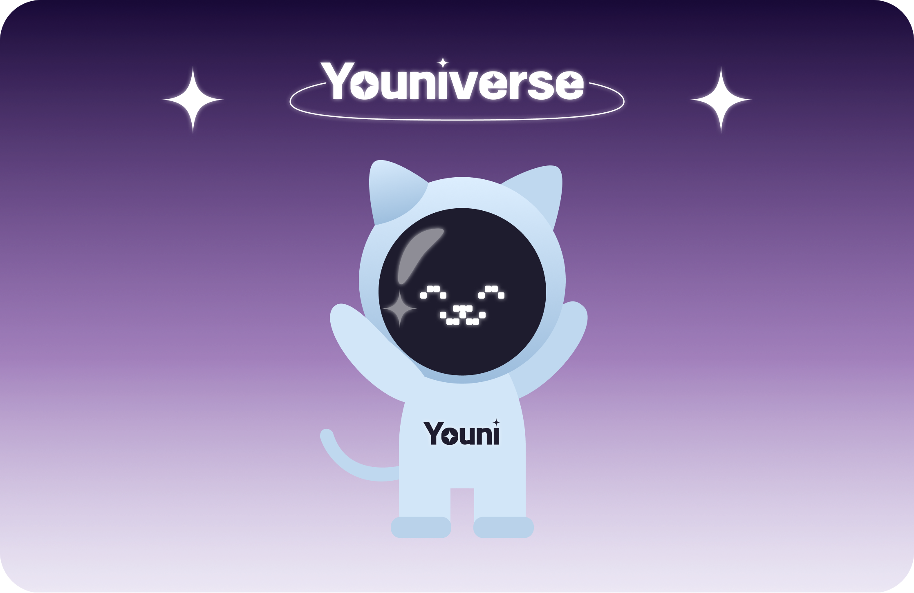
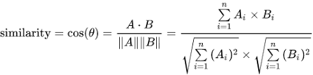
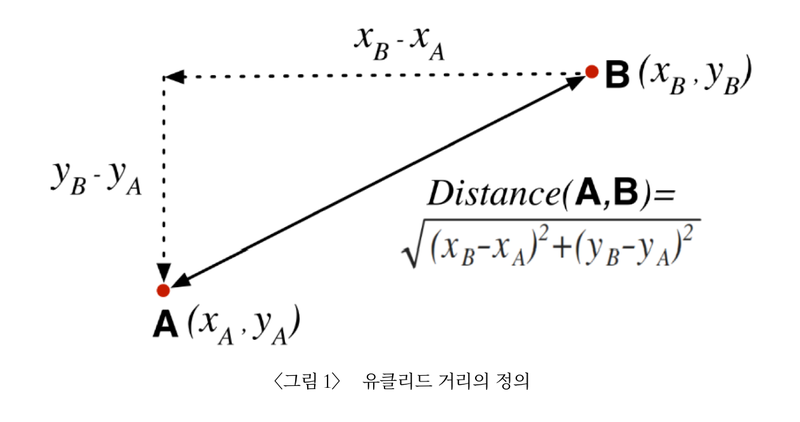

<div align="center">
    
    <h2>✨Youniverse✨</h2>
    <p>사용자의 유튜브 취향을 반영한 최적의 OTT, 영화 추천 플랫폼</p>
    <hr>
</div>


### 🕰️ 프로젝트 기간

23.08.28 ~ 23.10.06

### 🧑‍🤝‍🧑 멤버 구성

|                  이은경                   |                      박영기                       |               선다영                |               이수연                |               정동교               |                    함소명                     |
| :---------------------------------------: | :-----------------------------------------------: | :---------------------------------: | :---------------------------------: | :--------------------------------: | :-------------------------------------------: |
|         |                 |   |   |  |             |
|                 팀장(FE)                  |                     팀원(BE)                      |              팀원(FE)               |              팀원(FE)               |              팀원(BE)              |                   팀원(BE)                    |
| [rileyleee](https://github.com/rileyleee) | [park-yeong-ki](https://github.com/park-yeong-ki) | [seondy](https://github.com/seondy) | [bagoye](https://github.com/bagoye) | [dngyj](https://github.com/dngyj)  | [Hamsomyeong](https://github.com/Hamsomyeong) |

---

<div align=left>
<h3><a href="https://www.figma.com/file/MqXyd1p6142HDoqEEcQyIa/(%EC%99%B8%EB%B6%80)-B204-%EC%99%80%EC%9D%B4%EC%96%B4%ED%94%84%EB%A0%88%EC%9E%84?type=design&node-id=0%3A1&mode=design&t=tGzxNjrPYKSLeuSM-1"> FIGMA </a>　|　　
<a href="https://www.erdcloud.com/d/YbwD4oKDgd2waWLa6"> erdcloud </a>　|　

---

## :pushpin: 기술 스택

<div align=left>
<table>
    <tr>
        <td><b>Back-end</b></td>
        <td>


<br>


<br>


</td>
    </tr>
    <tr>
    <td><b>Front-end</b></td>
    <td>


    </td>
    </tr>
    <tr>
    <td><b>Infra</b></td>
    <td>


</td>
    <tr>
    <td><b>Tools</b></td>
    <td>
    
    

    </td>
    </tr>
</table>
</div>


<br/>
<br/>

---

## :pushpin: 프로젝트 소개

**1. 서비스 설명**

### **개요**

한줄 소개 : 사용자의 유튜브 취향을 반영한 최적의 OTT, 영화 추천 플랫폼
</br>

서비스 명 : **Youniverse**

### **타겟 🎯**

오늘 저녁 어떤 영화를 볼 지! 어떤 OTT를 구독해야 하는지 고민 중인 사람들

👉 **나의 취향을 200% 반영한 영화 및 OTT 추천이 필요한 사람들**

<br/>

## **2. 기획 배경**

### **배경**

- 세상에는 영화와 OTT가 너무 많습니다. 나의 취향을 제대로 반영한 영화를 추천받고 싶다는 간절함에서 시작된 프로젝트! 현대인의 취향이 가장 많이 녹아있는 서비스, 유튜브를 OTT와 결합해서 진정한 취향 저격 영화 및 OTT 추천 서비스를 구현했습니다.

### **의의**

- 영화 탐색에 오랜 시간을 들이지 않고 내 취향 저격 영화를 추천 받을 수 있습니다.
- 어떤 OTT를 구독할까, 모든 OTT를 구독해야하나 고민인 OTT 유목민에게 최선의 선택지입니다.
- 나랑 취향이 같은 사용자를 추천하고 영화 정보를 공유할 수 있습니다.

<br/>

## **3. 서비스 메인화면**

<table>
    <tr> 
        <td>  </td>
        <td>  </td>
    </tr>
    <tr> 
        <td> 회원가입 </td>
        <td> 회원가입 - ott 선택 </td>
    </tr>
    <tr> 
        <td>  </td>
        <td>  </td>
    </tr>
    <tr> 
        <td> 회원가입 - 선호도조사 </td>
        <td> 메인페이지 </td>
    </tr>
        <tr> 
        <td>  </td>
        <td>  </td>
    </tr>
    <tr> 
        <td> 추천페이지 - 유튜브 기반 추천 </td>
        <td> 추천페이지 - 선호도, 나이, 성별 기반 추천 </td>
    </tr>
    <tr> 
        <td>  </td>
        <td>  </td>
    </tr>
    <tr> 
        <td> 더보기 페이지 - ott 필터링 </td>
        <td> 마이페이지 - 인생영화등록 </td>
    </tr>
    <tr> 
        <td>  </td>
        <td>  </td>
    </tr>
    <tr> 
        <td> 마이페이지 - 인생영화등록완료 </td>
        <td> 마이페이지 - 전체페이지 </td>
    </tr>
     <tr> 
        <td>  </td>
        <td>  </td>
    </tr>
    <tr> 
        <td> 유저추천페이지 - 초기화면 </td>
        <td> 유저추천페이지 - 검색화면 </td>
    </tr>


</table>

<br/>

## :pushpin: 활용 기술

---

### 1. 텍스트데이터 분석
#### TF-IDF란?
- TF (단어 빈도, term frequency)
특정 단어가 문서 내에 얼마나 자주 등장하는지 나타내는 값
- DF (문서 빈도, document fequency)
다른 문서에서 특정 단어가 얼마나 자주 등장하는지 나타내는 값, 특정 단어를 가진 문서의 수
    - 여러 문서가 있을 때 하나의 문서에서만이 아니라 여러 문서에서 자주 등장하는 단어일 경우 중요도가 낮아짐
    - 하나의 문서에서만 많이 나오고 다른 문서에서 적게 등장할 경우 그 문서에서 해당 단어의 중요도가 높음을 알 수 있음
- 점수가 높은 단어일수록 다른 문서에는 많지 않고(IDF가 작고) 해당 문서에서 자주 등장하는(TF가 높은) 단어임을 의미

### 2. 유사도 구하기
#### 코사인 유사도 
- 두 벡터값 사이 코사인 각도



#### 유클리디안 유사도 
- 가장 기본적인 거리를 측정하는 유사도 공식


---

## 🏗️**서비스 아키텍쳐**

<div align="center">
 
</div>

</br>

## 👨‍💻 **프로젝트 진행**

---

## **1. GitLab**

- Git 컨벤션 및 Git flow 를 정하여 작업하였습니다.

- `work branch` , `develop branch` , `realese brach` 등 기능별, 용도별로 브랜치를 분기하여 사용하였습니다.

- 개발에 사용한 자세한 Git 컨벤션 및 GitFlow 에 적어 놓았습니다

## 2. Jira

- 한 주를 시작하는 월요일에 이번주에 진행되어야할 이슈들을 백로그에 등록 했습니다.
- 에픽은 페이지 단위로 구성하였습니다.
- 실시간으로 작업내용을 반영하여 팀원들이 작업 진행 상황을 서로 공유 할 수 있도록 하였습니다

## 3. Notion

데일리 스크럼을 진행하면서 하루동안의 예상되는 이슈사항을 체크 했습니다.

회의록 작성을 통해 회의 내용을 문서화 해놓았습니다.

GitLab, Jira, DB의 컨벤션 규칙을 문서화 시켜 놓았습니다

전체 일정 관리를 점검하며 프로젝트를 점검하였습니다.

팀원 모두가 공유해얗는 자료 및 링크는 노션에 정리 하여 쉽게 찾아 볼 수 있도록 하였습니다

### ERD


`erdCloud` 를 사용하여 erd 설계를 하였습니다.

## API

`Postman` 을 활용하여 API 문서를 작성하였습니다.

API문서
https://documenter.getpostman.com/view/22574154/2s9YJdXNqG#intro

## 🗂️ 프로젝트 파일 구조


### BackEnd

```
📦Back_End
 ┣ 📂gradle
 ┃ ┗ 📂wrapper
 ┣ 📂src
 ┃ ┣ 📂main
 ┃ ┃ ┣ 📂java
 ┃ ┃ ┃ ┗ 📂com
 ┃ ┃ ┃ ┃ ┗ 📂ssafy
 ┃ ┃ ┃ ┃ ┃ ┗ 📂youniverse
 ┃ ┃ ┃ ┃ ┃ ┃ ┣ 📂api
 ┃ ┃ ┃ ┃ ┃ ┃ ┣ 📂config
 ┃ ┃ ┃ ┃ ┃ ┃ ┣ 📂controller
 ┃ ┃ ┃ ┃ ┃ ┃ ┣ 📂dto
 ┃ ┃ ┃ ┃ ┃ ┃ ┃ ┣ 📂req
 ┃ ┃ ┃ ┃ ┃ ┃ ┃ ┗ 📂res
 ┃ ┃ ┃ ┃ ┃ ┃ ┣ 📂entity
 ┃ ┃ ┃ ┃ ┃ ┃ ┣ 📂handler
 ┃ ┃ ┃ ┃ ┃ ┃ ┃ ┣ 📂exception
 ┃ ┃ ┃ ┃ ┃ ┃ ┣ 📂mapper
 ┃ ┃ ┃ ┃ ┃ ┃ ┣ 📂repository
 ┃ ┃ ┃ ┃ ┃ ┃ ┣ 📂security
 ┃ ┃ ┃ ┃ ┃ ┃ ┃ ┣ 📂jwt
 ┃ ┃ ┃ ┃ ┃ ┃ ┃ ┃ ┣ 📂filter
 ┃ ┃ ┃ ┃ ┃ ┃ ┃ ┃ ┗ 📂service
 ┃ ┃ ┃ ┃ ┃ ┃ ┃ ┣ 📂oauth2
 ┃ ┃ ┃ ┃ ┃ ┃ ┃ ┃ ┣ 📂handler
 ┃ ┃ ┃ ┃ ┃ ┃ ┃ ┃ ┣ 📂service
 ┃ ┃ ┃ ┃ ┃ ┃ ┃ ┃ ┗ 📂userinfo
 ┃ ┃ ┃ ┃ ┃ ┃ ┣ 📂service
 ┃ ┃ ┃ ┃ ┃ ┃ ┣ 📂util
 ┃ ┃ ┗ 📂resources
 ┃ ┃ ┃ ┣ 📂static
 ┃ ┗ 📂test
 ┃ ┃ ┗ 📂java
 ┃ ┃ ┃ ┗ 📂com
 ┃ ┃ ┃ ┃ ┗ 📂ssafy
 ┃ ┃ ┃ ┃ ┃ ┗ 📂youniverse

```

### FrontEnd

```
📦FrontEnd
 ┣ 📂public
 ┃ ┣ 📂assets
 ┃ ┃ ┣ 📂Logo
 ┣ 📂src
 ┃ ┣ 📂apis
 ┃ ┣ 📂commons
 ┃ ┃ ┣ 📂constants
 ┃ ┃ ┗ 📂style
 ┃ ┣ 📂components
 ┃ ┃ ┣ 📂@commons
 ┃ ┃ ┣ 📂atoms
 ┃ ┃ ┣ 📂chart
 ┃ ┃ ┣ 📂movies
 ┃ ┃ ┣ 📂organisms
 ┃ ┃ ┣ 📂review
 ┃ ┃ ┣ 📂search
 ┃ ┃ ┗ 📂users
 ┃ ┣ 📂libs
 ┃ ┣ 📂pages
 ┃ ┃ ┣ 📂auth
 ┃ ┃ ┣ 📂main
 ┃ ┃ ┣ 📂notfound
 ┃ ┃ ┣ 📂profile
 ┃ ┃ ┣ 📂recommend
 ┃ ┃ ┗ 📂store
 ┃ ┗ 📂types

```

### Fast Api

```
📦Fast_Api
 ┣ 📂youniverse
 ┃ ┣ 📂recommend
 ┃ ┣ 📂repository
 ┃ ┗ 📂routers

```
